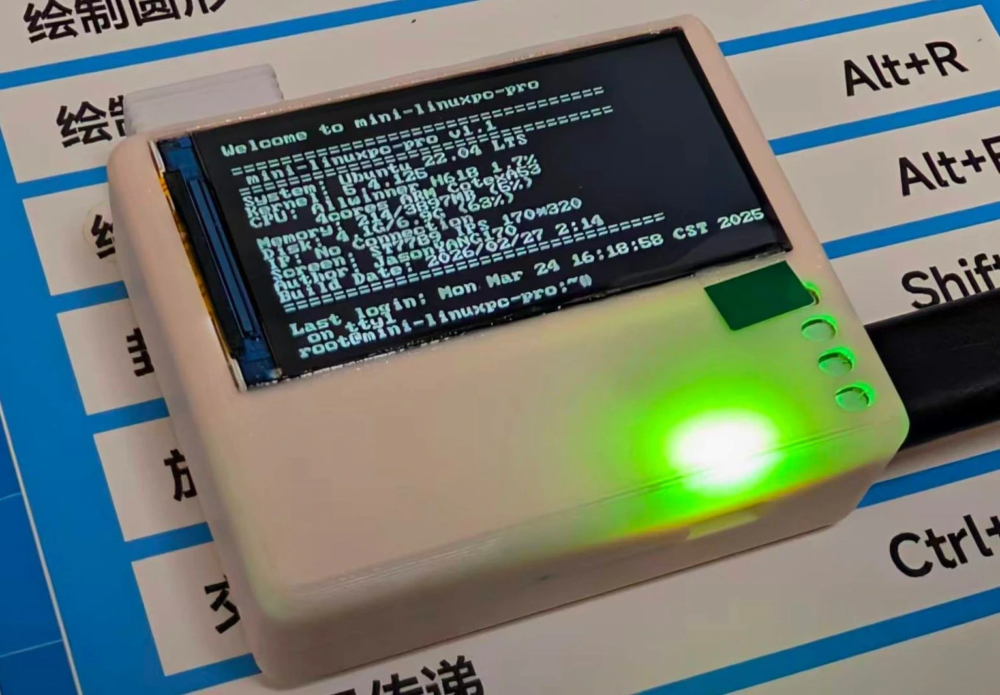

[简体中文](README.md) | [English](README_en.md)

# Mini-LinuxPC-Pro

Linux BSP build system for the Allwinner H618 SoC, based on the Longan SDK.

This image is built from the vendor SDK with Linux 5.15. For a newer Linux 6.X mainline kernel, see the **Armbian image**: [Armbian-Mini-LinuxPC-Pro](https://github.com/JasonYANG170/Armbian-Mini-LinuxPC-Pro)
Flash this image as the base first, then write Armbian with dd.

## Project showcase



[Hardware project and image source](https://oshwhub.com/jasonyang17/mini-linuxpc-pro)

## Hardware information

- **SoC**: Allwinner H618 (ARM Cortex-A53, quad-core)
- **Architecture**: ARM64 (aarch64)
- **Kernel**: Linux 5.4
- **Development Board**: P1

## Project structure

```
longan-h618/
├── brandy/           # Bootloader (U-Boot) 源码
├── build/            # 构建系统脚本和工具链
│   ├── toolchain/    # 交叉编译工具链
│   └── mkcommon.sh   # 主构建脚本
├── device/           # 设备配置
├── kernel/           # Linux 内核源码
│   └── linux-5.4/    # Linux 5.4 内核
├── rootfile/         # 根文件系统
├── tools/            # 打包和烧录工具
└── build.sh          # 主构建入口脚本
```

## Quick Start

### Requirements

- Ubuntu 20.04+ (22.04 recommended)
- At least 20GB free disk space

### Local build

```bash
# 1. 安装依赖
sudo apt-get update
sudo apt-get install -y build-essential git libncurses5-dev \
    libssl-dev bc bison flex u-boot-tools python3 python3-dev \
    python3-pip swig device-tree-compiler cpio gawk wget unzip \
    dosfstools mtools kmod rsync fakeroot

# 2. 配置
chmod +x build.sh
echo -e "1\n1\n0\n0\n0" | ./build.sh config

# 3. 编译 bootloader
./build.sh bootloader

# 4. 编译内核
./build.sh kernel

# 5. 打包固件
./build.sh pack
```

Firmware output: `out/pack_out/` directory

### GitHub Actions Compilation

This project supports CI to automatically compile bootloader and kernel:

1. Fork this repository
2. Enter the Actions page
3. Select "Build Longan H618 Firmware"
4. Click "Run workflow"
5. Wait for the build to finish and download the artifacts

> **Note**: CI only compiles the bootloader and kernel, and firmware packaging needs to be executed locally `./build.sh pack`.

## Package firmware using CI artifacts

The CI build artifacts are available on the Releases page and include:
- `u-boot-sun50iw9p1.bin` - Bootloader
- `Image.gz` - kernel image
- `sunxi.dtb` - Device Tree
- `rootfs.ext4` - Root file system
- `rootfs.cpio.gz` - initramfs

Local packaging steps:

```bash
# 1. 克隆仓库
git clone https://github.com/JasonYANG170/Mini-LinuxPC-Pro.git
cd Mini-LinuxPC-Pro

# 2. 下载 CI 产物（从 Release 页面下载）
# 将 u-boot-sun50iw9p1.bin 放到 device/config/chips/h618/bin/
# 将 rootfs.ext4 放到 test/dragonboard/
# 将 rootfs.cpio.gz 放到 kernel/linux-5.4/

# 3. 配置（如果还没配置过）
echo -e "1\n1\n0\n0\n0" | ./build.sh config

# 4. 打包固件
./build.sh pack

# 固件输出：out/pack_out/*.img
```

## Supported features

- Supports ST7789V LCD display
- Support dual-screen display configuration

## License

This project is based on Allwinner Longan SDK, please follow the relevant license agreement.
